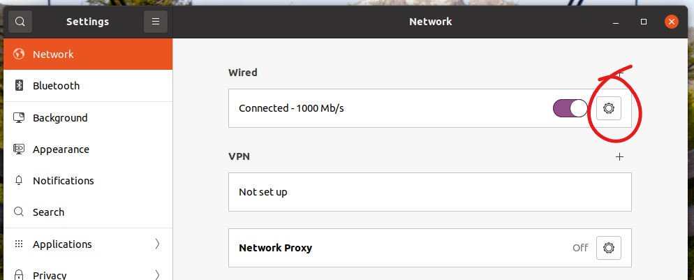

== Virtual Machine Target Connections

(C) Copyright Doulos Ltd, 2022

=== VMWare Workstation/Player

==== Serial Connection

To connect the USB-UART device find it in the VMWare Removable Devices menu: (Player) *Player > Removable Devices > Future Devices FT230X 96Boards Console*; (Workstation) *VM > Removable Devices > Future Devices FT230X 96Boards Console*.

If it isn't connected, connect using the device sub-menu as shown below (picture shows VMWare Player, sub-menu is the same in Workstation):

==== Ethernet Connection

To connect the Ethernet, first ensure that the cable is connected to the board (using the appropriately labelled USB-Ethernet adapter if required) and that the provided Ethernet cable is connected to the adapter and the host laptop. Then open the VM tool *Virtual Machine Settings* menu via: (Player) *Player > Manage > Virtual Machine Settings...*; (Workstation) *VM > Settings*.

In the *Hardware* tab select the *Network Adapter* from the list of devices on the left-hand side. On the right-hand side select *Bridged: Connected directly to the physical network*:

Depending on the network adapters connected to the host PC you may need to further configure the bridged connection to use the network adapter which is connected to the target. This is done differently in VMWare Player and Workstation:

NOTE: Administrator rights may be required.

* *Player*: Select *Configure Adapters* to open the *Automatic Bridging Settings...* and in the resulting dialog box make sure the appropriate network adapter is selected only, as shown below:

* *Workstation*: Select *Edit > Virtual Network Editor...* to open the network configuration tool. Under the *VMnet Information* section, select *Bridged (connect VMs directly to the external network)*. Then click *Automatic Settings...* and in the resulting dialog box make sure the appropriate network adapter is selected only, as shown below:

Apply and close the configuration settings.

The Linux host network should already be configured to a static IP of 192.168.1.254 and the target IP will be 192.168.1.10. No external network connectivity is required. First check your host IP:

[,shell]
----
host$ ifconfig
enp0s3: flags=4163<UP,BROADCAST,RUNNING,MULTICAST>  mtu 1500
   inet 192.168.1.254  netmask 255.255.255.0  broadcast 192.168.1.255
...
----

If it is not set to *192.168.1.254* then you need to check the network connections within the Linux VM. To do this open the Network Connections via the settings menu opened by right clicking anywhere on the desktop and selecting *Settings*. Then select *Network* in the list on the left and then open the *Wired* network settings via the 'cog' button, as shown below

Select the *IPv4 Settings* tab and then change the *IPv4 Method:* field to *Manual*. Then edit the top line of the *Addresses* table  and add the following information:

Address = *192.168.1.254*

Netmask = *24*

_(Gateway can be left blank)_

And click *Apply* and then close the dialogs. Recheck the IP address with `ifconfig`.

=== Oracle VirtualBox

==== Serial Connection

To open the serial connection, first select the USB-UART device in the VirtualBox Devices menu: *Devices > USB > Future Devices FT230X 96Boards Console*:

==== Ethernet Connection

To connect the Ethernet, first ensure that the cable is connected to the board (using the appropriately labelled USB-Ethernet adapter if required) and that the provided Ethernet cable is connected to the adapter and the host laptop. Then open the VM tool *Devices* menu and select *Devices > Network > Network Settings...*.

In the resulting settings box, ensure that *Bridged Adapter* is selected and then that the device is the *wired Ethernet interface* of the laptop (or the appropriate Ethernet adapter), e.g.:

The Linux host network should already be configured to a static IP of 192.168.1.254 and the target IP will be 192.168.1.10. No external network connectivity is required. First check your host IP:

[,shell]
----
host$ ifconfig
enp0s3: flags=4163<UP,BROADCAST,RUNNING,MULTICAST>  mtu 1500
   inet 192.168.1.254  netmask 255.255.255.0  broadcast 192.168.1.255
...
----

If it is not set to *192.168.1.254* then you need to check the network connections within the Linux VM. To do this open the Network Connections via the settings menu opened by right clicking anywhere on the desktop and selecting *Settings*. Then select *Network* in the list on the left and then open the *Wired* network settings via the 'cog' button, as shown below

Select the *IPv4 Settings* tab and then change the *IPv4 Method:* field to *Manual*. Then edit the top line of the *Addresses* table  and add the following information:

Address = *192.168.1.254*

Netmask = *24*

_(Gateway can be left blank)_

And click *Apply* and then close the dialogs. Recheck the IP address with `ifconfig`.
